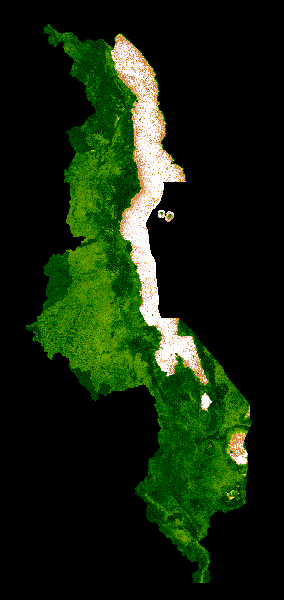

# Visualization and Analysis in Google Earth Enginge (GEE)

The GIF shows NDVI data from a MODIS composite of Malawi. Malawi is a small, landlocked country located in southern Africa. It is home to the third largest lake in Africa, Lake Malawi, and  The coutnry has a tropical climate and its vegetation consists of mostly savannah woodland and forests.

NDVI stands for normalized difference vegetation index, which is a reflectance-based vegetation index, and MODIS is a moderate resolution satellite, launched by NASA. NDVI is mapped to a color gradient from tan to dark green representing low to high photosynthetic capacity (low to high vegetation cover density/productivity).

The outputs in this repository were made using the tutorial found at the MODIS NDVI Times Series Animation tutorial on the GEE community web site: https://developers.google.com/earth-engine/tutorials/community/modis-ndvi-time-series-animation#2_define_clipping_and_region_boundary_geometries and the code can be found in chikondi_malawi_gee.js

> 

 
